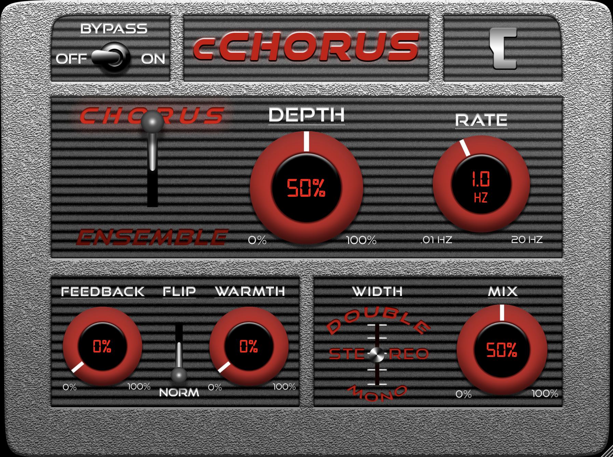

# cChorus-Fancy

<p align="center"></p>

## Overview

cChorus-Fancy is an alternative UI for the [cChorus](https://github.com/calgoheen/cChorus) audio effect plugin, designed by [Adam Field](https://www.instagram.com/lastlivingartist/).

## Build Instructions

This project requires [CMake](https://cmake.org/) to build. On Windows, [Ninja](https://ninja-build.org/) is also required.

```
# Clone the repo
git clone --recurse-submodules https://github.com/calgoheen/cChorus-Fancy.git
cd cChorus-Fancy

# Mac
cmake -Bbuild -DCMAKE_OSX_ARCHITECTURES="x86_64;arm64" -DCMAKE_BUILD_TYPE=Release
cmake --build build

# Windows
cmake -Bbuild -GNinja -DCMAKE_BUILD_TYPE=Release
cmake --build build
```

## External Dependencies

- [JUCE](https://github.com/juce-framework/JUCE)
- DSP modules from [chowdsp_utils](https://github.com/Chowdhury-DSP/chowdsp_utils)
- CLAP plugin format is built with [clap-juce-extensions](https://github.com/free-audio/clap-juce-extensions)
